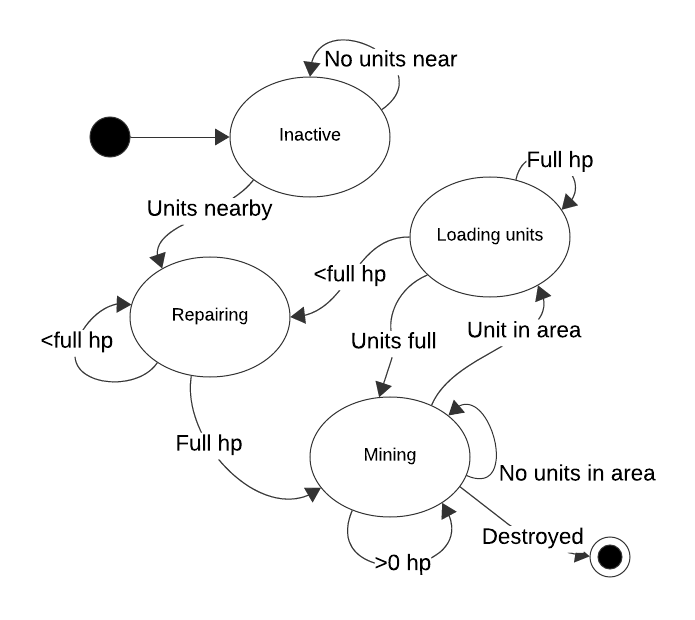

# Sands of Orisis
  
**Contributors**:  
- Colm Murphy
- Darragh Murphy
- Ben Shorten
- David Wilson  

**Repository**: [Github - Sands of Orisis](https://github.com/colmmurphyxyz/CS3305-2024-Team-2)  
### Synopsis  
Orisis has been recently discovered to hold the incredibly rare and valuable resource, unobtainium. You, commander of a fleet, have landed near a deposit of unobtainium to find that you are not the only one to have discovered this planet's treasure.
Face off in 1v1 battles with another player as you compete for control over ore deposits of iron and unobtainium. As each player obtains more resources they can progress further up the technology tree, allowing the construction of powerful machines with the help of scientific laboratories and weapons barracks.
---
## User guide
This is a quick start guide to the game. Discussing the controls, the objective, and suggested game play.

### Controls
---
- **Z** - Lock/Unlock the camera
- **Mouse** - With camera unlocked, move the cursor to the edge of the screen to move the camera.
- **Left click** - Interact/Cancel interaction
- **Click and drag** - Select units
- **Right click** - Move selected units. Or interact with a building with selected units.
- **Esc** - Open the menu (SFX, Music)

### Objective
---
Destroy the enemy headquarters.

### Mechanics
---
- **Resources** - A small amount of Iron is generated at the HQ. Iron is used to build certain structures and units.

- **Buildings** - Buildings are used to gather resources, unlock units, and provide other benefits. Buildings (except mines), can be build near the HQ. Some buildings need to be repaired/build before they begin to function.

- **Repairing** - Damaged buildings can be repaired by selecting drone(s) and right clicking on the building. The worker will interact with the building until it is fully repaired.

- **Units** - Units are used to gather resources, attack, and defend. Units can be built at the HQ. Some units need to be unlocked by building certain buildings.

- **Mines** - Mines are used to gather resources. Mines can be built on Iron or Unobtainium deposits. Mines need to be repaired before they begin to function. Quarried resource are store in the mine and need to be returned to the HQ by a drone before they can be spent.

### Game play
---
- **Gather resources** - To gather resources, place a mine on a resource deposit. Then build a drone to gather the resources. The drone will return the resources to the HQ.

- **Barracks** - Build a barracks to unlock the ability to spawn units to attack and defend.

- **Defence** - Build a defence tower to protect your base.

- **Laboratories** - Build a science and fusion lab to unlock new units and build your army.

- **Attack** - Scout the area, progress to centre of the map and gain control of the enemy headquarters.

## Developer guide (Documentation)
This is an overview of the game's important features, covering them in more detail.

### Structures and mechanics
---
#### **Placement System**
A running process is in place to verify whether a variable has been assigned an instance, specifically a building in this case. This check is done through a string received from a button signal from the sidebar interaction menu, which triggers a switch case function. Once the variable is assigned a building, it tracks the player's mouse movements and continuously updates until the building is placed, at which point its position is locked. The placement is finalized through a network function that removes the building and simultaneously replaces it, reflecting changes for both players.

This class also includes validation for placements, checking for collisions and restricted areas. In the case of mines, it examines ore deposit areas and their types to create mine instances. The class also handles user error reporting for incorrect placements and dynamically updates the prices of each building for the corresponding button.

#### **Build and repair** 
Each building is equipped with a repair function, activated when a drone is assigned to a damaged building. The drone initiates repairs, and works until the building is fully restored, or all assigned drones are eliminated. Following the repair, the drone needs to be reassigned to building to interact. Repurposing the detection system; Repairing is proportional to the number of units in the detection radius, the more units the faster the repair. This is done by getting the number of units in the detection radius, increasing the health partially.

#### **Base File**
This serves as the parent superclass for every building within the game, and provides the base framework for all essential functions. Once a building is place it is added to a group for easier management. The superclass defines key variables such as team number, health data, borders, state, and detection mechanisms. It also sets the lighting and shading for Fog of War (F.O.W.), adds borders and detection radii for structures. Following this setup, buildings are scheduled for construction.

Functions in this script are responsible for repairs, damage and destruction events as well as enemy and collision detection.

#### **Headquarters**
The headquarters is the central building for the player, it acts as the command centre as well as the win condition. It's main function is to train (spawn) new units through an interaction menu and to store collected resources. It also updates displayed price for units and controls button visibility based on game progression.

#### **Valid placement**
In order to balance and maintain a fair game, we limited players to placing buildings (other than mines) only within the vicinity of the HQ, preventing the defence of resources using structures, as well as using them to uncover fog of war. This is done by using taking the line distance between the HQ position and current mouse placement position.

#### **Spawning units**
To optimize for mass buying units (spamming) and prevent grouping of units, we implemented a spawn radius near HQ which should distribute the spawning randomly. We implemented this by taking the HQ position as a center vector, a random angle and min/max distance to locate a random point within a ring round HQ.

#### **Mine**
There are two types of mines, iron and unobtainium, this is automatically set by the deposit that the mine is placed on. All mines have a maximum storage capacity and a mining rate. Mines need to be built (fully repaired) before they start working. Each mine has a mining rate and maximum storage capacity. Drones need to be assigned to a mine to transport resources to HQ.

#### **Defence**
Towers are your second line of defence should your units fail. These medium-ranged, high HP buildings with quick reload and fast bullet travel will pack a punch with almost any enemy nearby. A tier system was in place to upgrade defences for higher range, faster reload and more health; this was scrapped due to time constraints and complexity of integration. (*In development*)

#### **Detection system**
Each building has an invisible collision area, this serves as the detection radius. Once a unit enters a building's range, the unit is classified into a friendly or enemy array determined by their assigned team. As an issue arose, units that were already in the detection radius before placing were not accounted for; An addition failsafe was devised to get all unit (bodies) in the area and sort them before the primary system logic starts.
The friendly array is used for the likes of repair and interaction, while the enemy array contains targets for defences in order of FIFO. When a unit exits this range it is no longer targeted, and will be lower priority when reentering.

#### **Barracks**
This building is the first upgrade to begin the game, it allows the player to spawn units other than the default drone. It unlocks the Bruiser and Sniper units, which are the first tier capable of attacking. As for all other progression buildings, once destroyed the player will lose the ability to spawn these units.

#### **Science Lab**
Unlocked after the barrack, this building signifies mid-game progression. It unlocks the second tier of units, the Scout and Warden. The Scout is a fast, low health unit that can be used to uncover fog-of-war and gather information. The Warden is a high health, high damage unit that can be used to tank damage and deal damage to enemy units.

#### **Fusion Lab**
A late-game building that unlocks the final tier of units, the Fusion Screecher. A high damage, high health unit, equipped with a deadly laser that obliterates enemies in its path.

## Team planning and communication
### Communication
Our primary mode of communication was a Discord server, chosen for its organized instant messaging. It allowed for quick updates, coordination and brainstorming, minimizing errors and conflicts as all members were informed of any task changes.
 

### Planning
We chose Trello for project planning due to its intuitive board system. Tasks were sorted into lists representing different states of development. Early, Mid and Late-Development objectives, tracking in-progress and marking Done or Half-done(bugged) tasks. The option to assign task to members provided accountability and improved communication.  
For bug tracking we combined a Trello list and the built-in Github feature for quick resolutions.

### Design
Used Lucidchart to created roadmaps, flow graphs and diagrams for game and logic design which was used as a visual reference point throughout development.
 

