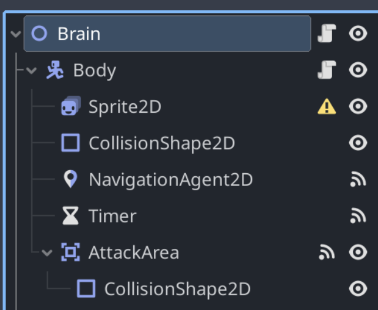

# Sands of Orisis
  
**Contributors**:  
- Colm Murphy
- Darragh Murphy
- Ben Shorten
- David Wilson  

**Repository**: [Github - Sands of Orisis](https://github.com/colmmurphyxyz/CS3305-2024-Team-2)  
### Synopsis
Orisis has been recently discovered to hold the incredibly rare and valuable resource, unobtainium. You, commander of a fleet, have landed near a deposit of unobtainium to find that you are not the only one to have discovered this planet's treasure.
Face off in 1v1 battles with another player as you compete for control over ore deposits of iron and unobtainium. As each player obtains more resources they can progress further up the technology tree, allowing the construction of powerful machines with the help of scientific laboratories and weapons barracks.

---
## User guide

This is a quick start guide to the game. Discussing the controls, the objective, and suggested game play.

### Installation
---
#TODO change this to instructions for running the compiled game
1. **Import project** - Clone the repository and open the project in Godot.
2. **Run the game** - Run the game by pressing the play button in the top right corner of the Godot editor.
- **Note**: If you wish to test the game with two instances. In godot, go to 'Debug' -> 'Run multiple instances' and select 2 instances before running the game.
3. **Remote connection** - If you wish to play with a friend, you can host the game and give your friend your local IP address. Set the same port and address in the main menu. *Make sure both computers are on the same network.*

---
### Controls
- **Z** - Lock/Unlock the camera
- **Mouse** - With camera unlocked, move the cursor to the edge of the screen to move the camera.
- **Middle Mouse Button** - With camera unlocked, hold down MMB and drag the cursor to pan the camera
- **Arrow Keys** - With camera unlocked, use the arrow keys to pan the camera
- **Scroll Wheel** - zoom the camera in/out
- **Left click** - Interact/Cancel interaction
- **Left Click and drag** - Select units
- **Right click** - Move selected units. Or interact with a building with selected units.
- **Esc** - Open the menu (SFX, Music)
#### Secret Debug Controls
- We used these controls for testing and debugging purposes. They have been left in the final game as an optional extra for players who wish to use them
	- **d, s, b, w, f, t keys** - spawn a Drone, Sniper, Bruiser, Warden, Fusion Screecher or Scout, repectively at the current cursor position
	- **I**  grant the player 100 iron
	- **U** grant the player 100 unobtainium

### Objective
---
- Gather iron to expand your army
- Contest the valuable unobtainium deposits in the centre of the map
- Use your newly-acquired unobtaiunium to bolster your army with the powerful Warden and Fusion Screecher units
- Launch an attack to crush your enemies, and wipe their headquarters from the face of Orisis

### Mechanics
---
- **Resources** - A small amount of Iron is generated periodically at the HQ.  Iron is used to build certain structures and units.

- **Buildings** - Buildings are used to gather resources, unlock units, and provide other benefits. Buildings (except mines), can be build near the HQ. Some buildings need to be repaired/build before they begin to function.

- **Repairing** - Damaged buildings can be repaired by selecting drone(s) and right clicking on the building. The worker will interact with the building until it is fully repaired.

- **Units** - Units are used to gather resources, attack, and defend. Units can be built at the HQ. Some units need to be unlocked by building certain buildings.

- **Mines** - Mines are used to gather resources. Mines can be built on Iron or Unobtainium deposits. Mines need to be repaired before they begin to function. Quarried resource are store in the mine and need to be returned to the HQ by a drone before they can be spent.

### Game play
---
- **Gather resources** - To gather resources, place a mine on a resource deposit. Then build a drone to gather the resources. The drone will return the resources to the HQ.

- **Build and defend** - Build different structures to unlock the ability to spawn more units to dominate the battlefield.

- **Attack** - Take control of the map and its valubale resources
## Developer guide (Documentation)

This is an overview of the game's important features, covering them in more detail.

---
### Brief word on Godot
Godot is built upon the idea of a ‘node’ hierarchy. Nodes can be best described as classes that have predefined methods and attributes that can be assorted into a tree that forms a scene. 

Below describes a typical player scene, with the ‘player’ node being a CharacterBody2D which is a node that holds an x,y position in the world. Its children will all inherit this position and follow the node wherever it goes. This kind of node chaining is the basis of Godot

The player scene can then be placed directly into another scene, allowing for modular and fast code compilation. 

Scripts are attached to these nodes, written in GD script, which is similar to Python.

---

### Units
Units are what we have defined as any node capable of movement, controlled by the player. Units are comprised of a brain node, which holds all the values and functions to do with the node operating.

The child of the brain node is the body, which holds its physical ‘presence’ in the game world. The body handles how the unit moves and tells its brain of any collisions it has with other nodes.

Below depicts what most unit trees look like

It was important for us to keep the frame by frame processing of units down to a minimum. Inefficient code may not affect the overall framerate of a game if it's only being run by 1 node, but there could be hundreds of units in a game, each with its own path finding, detection areas and other computationally expensive processes.

---

### Pathfinding 

Pathfinding is based on A*, which is an algorithm built upon Dijkstra's algorithm, but takes into account the distance from the final destination when calculating the path.

Pathable area is defined by the tilesets we created. We can set a collision shape for each tile and set a flag for whether it is navigable or not. When the game scene is loaded, any collidable areas are baked into a navigation mesh, allowing the engine to efficiently calculate A* paths for any units that require it.

In the latter half of development for the project we realised that the inbuilt pathfinding that Godot uses was computationally expensive and did not scale well when dealing with many units over large distances. This forced us to peel back the navigation system we had set up for the units and look into ways to optimise it for our needs.

We realised that the engine implicitly recalculates the path every second which was causing huge slowdown when the unit count grew too large. We edited the system so that it only ran when directly called, meaning that units would only create a path usually once or possibly twice if needed when navigating to its destination position.

---

### How do units know what to do
Due to the nature of games and the many possibilities and outcomes that comes with giving players full control of what happens, this usually requires a sophisticated state machine. Our state machine works off of a base state, the persistent state, which is the unit's brain. This holds the functions that carry out regardless of the unit's current state.

Below is a finite state machine diagram with a simplified version of the entry and exit points for each state.

It should be noted that most states are overridden when a unit receives a command from the selection system, which is expanded upon below.

#### Idle State

This is the state that most other states will usually default to. This will switch to an attacking state if an enemy unit or building enters within its detection range.

#### Moving State

This state does not control the movement of the unit. It describes what the unit does while it is pathing towards its destination. It checks if the body has reached a target destination, if it has, switch state back to idle. 

If the unit has been assigned a node to chase by the selection system, the moving state will constantly reassign the target destination to the position of the targeted node. This makes the node follow the enemy node.

If the enemy node is within the minimum attack range, switch to attacking state with the enemy node as the target.

#### Attacking State

The unit will remain in the attack state as long as it has a target to attack. How often it attacks is based on a unit specific attack speed timer. Once this timer reaches 0, it will play the attack animation. On a predetermined frame of the animation, it will fire a bullet at a target and play a unit specific sound.

#### Interacting With Building State

This is a sort of in between state, it runs through several checks to decide what state to transition to. This interacting with building state is assigned by the selection system with a target building

It will first check if the building is on the same team, if it isn't, switch to attack state with the building as the target.

If the unit can mine or repair, begin mining or repairing depending on building state.

#### Mining 

Checks if ore is loaded onto the unit, if it is, path towards HQ, if it isn't, path towards mine until mine assigns ore.

#### Repairing

Path towards building until building is full health

---
### Attacking System

Units detect who to attack via a collision circle around themselves. Whenever a unit enters this circle, it is added to a list of possible candidates to target. This list is sorted by distance, so that units will effectively target the closest threat. 

Once a unit has fired its bullet, the bullet is assigned the unit's target. We wanted bullets to be a guaranteed hit once fired, as it may be frustrating if units keep entering in and out of cover or range.

The bullet will accelerate towards its target with a damage and speed value determined by the unit that fired it.

---

### Selection System

The selection system works by detecting when the player left clicks. On click, it begins drawing a box and marking the corners of each point. When the player releases a left click, it creates a detection polygon, using the four marked corners. Any unit that is on the same team as the client that collides with this box is added to a selection array.

When the user right clicks, a small collision box is created at the mouse position to detect any enemy units or buildings and sets them as a target to attack for the selected units.

If the user right clicks on an empty space, any units in the selection array have their state changed to moving, with the target destination being the x,y coordinate of the mouse position.

---

### Shaders

Any units in the selection array have a shader uniform outline parameter set to true, highlighting them in a white outline

Shaders in Godot written in GLSL. Uniforms are variables that can be passed to the fragment and vertex portions of a shader from GD-Script. 

As an oversimplified explanation of GLSL shader layout;

The vertex portion of a shader has access to individual pixel corners in an image and can perform calculations based on them.

The fragment shader is responsible for modifying the output of individual pixel colour/alpha.

In our shader for the units, the vertex shader calculates whether or not the pixel has a neighbour that has an alpha value of 0, if it does, return true. The fragment then checks every pixel and runs the vertex function. If the function returns true, colour the pixel white.

When units are damaged they turn white, which also is shader based, which is fragment shader based, simply checks if the pixel alpha is 1, if it is, set pixel colour to white. A uniform boolean toggles this part of the shader based on a timer. 

Any unit that is not on the same team as the client instance has each pixel's RGB multiplied by an average that makes it appear more red, to differentiate between your own units and the enemies.

---

## Sound

A dynamic soundscape was an important goal for us in order to inject some life and personality into the game.

We achieved this by making every sound local to the position of creation of the node emitting the sound. This means that the sound volume scales with the closeness to the camera and also depending on the amount of zoom the camera. 

This means that if unit combat is taking place at many different places over the map, the sound remains localised to only the focus of the player.

It was important for us to also allow the player to adjust the volume of the sound effects and music separately. For this we had to create separate audio buses.

Audio buses, like everything in Godot, have a tree layout in which nodes inherit properties from their parents. We connected every sound effect to the SFX audio bus, then added that as a child of the SFX master. 

This means we could adjust the SFX bus by zooming in/out the camera, keeping the dynamic soundscape, while the SFX master is able to adjust the overall volume of sound effects, regardless of their distance to camera or camera zoom amount.

At every point we attempted to inject a sound effect into actions that the user performs such as clicking, placing builds and selecting specific units. This gives alongside the visual feedback, audio feedback, which is important to give a game a more immersive feel.

---

### Music

When it came to adding music it was as simple as adding the sound to another bus called music and hooking that up to a master bus.

In keeping with the dynamic soundscape we also wanted this to extend to the music.

We implemented this via 3 separate music tracks that play at different periods of the game.

Each is the same length so all 3 are playing at the same time, with only 1 playing at an audible volume. When a barracks/fusion laboratory is placed, this signals the mid/end stage of the game and triggers the switching of volumes of the playing tracks.

 

In using separate buses, we were able to swifty design a volume UI when ESC is pressed as seen below.

---

### Map

For our map we decided to keep a single large map for 2 players to fight on. The map itself is built on a 16x16 pixel grid. For the assets we found a generic tilemap that we used for the art. To create the illusion of depth we broke the tilemap up into different layers. These areas have their saturation and decreased and made brighter to give the impression of higher ground.

In placing the tilemap we found great difficulty in using the inbuilt tile editor, so much so that we ended up downloading a plugin called Better-Terrain. This overhauls the tile placement, allowing us to connect the tiles in an order that made sense aesthetically without needing to manually place each tile. 

---

### Visibility System

In order to simulate a fog of war we needed to implement unit visibility. This means that you should only be able to see an enemy unit if one of your own units can see it. 

This was a key aspect for us to implement as hiding units in the fog of war is a very important strategy in RTS games.

The visibility system works independently on each client as each client runs its own instance of the game.

The visibility system is as lightweight as possible since every unit would be running it.

It essentially works by every enemy unit having its own ‘visibility level’ starting at 0. When an enemy unit enters or leaves a unit's detection radius, this visibility level is added or subtracted. If the level is below 1, the unit is unrendered. 

To visualise this effect we drew a large grey image over the map, and each unit draws a circle texture that subtracts the alpha on every pixel of the grey image it touches. This effect gives the impression of a fog of war. This image scales with the visibility radius for each individual unit.

---

### Structures and their mechanics

#### **Placement System**
A running process is in place to verify whether a variable has been assigned an instance, specifically a building in this case. This check is done through a string received from a button signal from the sidebar interaction menu, which triggers a switch case function. Once the variable is assigned a building, it tracks the player's mouse movements and continuously updates until the building is placed, at which point its position is locked. The placement is finalized through a network function that removes the building and simultaneously replaces it, reflecting changes for both players.

This class also includes validation for placements, checking for collisions and restricted areas. In the case of mines, it examines ore deposit areas and their types to create mine instances. The class also handles user error reporting for incorrect placements and dynamically updates the prices of each building for the corresponding button.

#### **Build and repair** 
Each building is equipped with a repair function, activated when a drone is assigned to a damaged building. The drone initiates repairs, and works until the building is fully restored, or all assigned drones are eliminated. Following the repair, the drone needs to be reassigned to building to interact. Repurposing the detection system; Repairing is proportional to the number of units in the detection radius, the more units the faster the repair. This is done by getting the number of units in the detection radius, increasing the health partially.

#### **Base File**
This serves as the parent superclass for every building within the game, and provides the base framework for all essential functions. Once a building is place it is added to a group for easier management. The superclass defines key variables such as team number, health data, borders, state, and detection mechanisms. It also sets the lighting and shading for Fog of War (F.O.W.), adds borders and detection radii for structures. Following this setup, buildings are scheduled for construction.

Functions in this script are responsible for repairs, damage and destruction events as well as enemy and collision detection.

#### **Headquarters**
The headquarters is the central building for the player, it acts as the command centre as well as the win condition. It's main function is to train (spawn) new units through an interaction menu and to store collected resources. It also updates displayed price for units and controls button visibility based on game progression.

#### **Valid placement**
In order to balance and maintain a fair game, we limited players to placing buildings (other than mines) only within the vicinity of the HQ, preventing the defence of resources using structures, as well as using them to uncover fog of war. This is done by using taking the line distance between the HQ position and current mouse placement position.

#### **Spawning units**
To optimize for mass buying units (spamming) and prevent grouping of units, we implemented a spawn radius near HQ which should distribute the spawning randomly. We implemented this by taking the HQ position as a center vector, a random angle and min/max distance to locate a random point within a ring round HQ.

#### **Mine**
There are two types of mines, iron and unobtainium, this is automatically set by the deposit that the mine is placed on. All mines have a maximum storage capacity and a mining rate. Mines need to be built (fully repaired) before they start working. Each mine has a mining rate and maximum storage capacity. Drones need to be assigned to a mine to transport resources to HQ.

#### **Defence**
Towers are your second line of defence should your units fail. These medium-ranged, high HP buildings with quick reload and fast bullet travel will pack a punch with almost any enemy nearby. A tier system was in place to upgrade defences for higher range, faster reload and more health; this was scrapped due to time constraints and complexity of integration. (*In development*)

#### **Detection system**
Each building has an invisible collision area, this serves as the detection radius. Once a unit enters a building's range, the unit is classified into a friendly or enemy array determined by their assigned team. As an issue arose, units that were already in the detection radius before placing were not accounted for; An addition failsafe was devised to get all unit (bodies) in the area and sort them before the primary system logic starts.
The friendly array is used for the likes of repair and interaction, while the enemy array contains targets for defences in order of FIFO. When a unit exits this range it is no longer targeted, and will be lower priority when reentering.

#### **Barracks**
This building is the first upgrade to begin the game, it allows the player to spawn units other than the default drone. It unlocks the Bruiser and Sniper units, which are the first tier capable of attacking. As for all other progression buildings, once destroyed the player will lose the ability to spawn these units.

#### **Science Lab**
Unlocked after the barrack, this building signifies mid-game progression. It unlocks the second tier of units, the Scout and Warden. The Scout is a fast, low health unit that can be used to uncover fog-of-war and gather information. The Warden is a high health, high damage unit that can be used to tank damage and deal damage to enemy units.

#### **Fusion Lab**
A late-game building that unlocks the final tier of units, the Fusion Screecher. A high damage, high health unit, equipped with a deadly laser that obliterates enemies in its path.

## Networking (I sure hope it is)
Multiplayer is a crucial component of our game. It is imperative that players can compete against each other seamlessly over the network with minimal lag or de-synchronisation.  In our implementation we made use of Godot's Multiplayer API wherever appropriate and we implemented custom networking logic for situations where the built-in libraries weren't suitable

### Godot multiplayer API
The latest version of the Godot engine overhauled its multiplayer networking and synchronisation APIs. Multiplayer logic is configured primarily through the built-in *MultiplayerSpawner* and *MultiplayerSynchronizer* nodes. These nodes handle the spawning and despawning of actor nodes, as well as synchronising their properties across peers. 
Godot assigns every peer in a network a unique 16-bit id. The server is always assigned the id 1, while other peers are assigned randomly-generated ids.
Every node has a *multiplayer authority* property. This is a 16-bit integer id of the peer that "owns" the node. This value defaults to 1 (the server) if not explicitly set. Note that the peer that spawns a node into the game may not always be its multiplayer authority.
We make use of RPC methods to perform additional network actions not provided by the MultiplayerSpawner and MultiplayerSynchronizer nodes
#### MultiplayerSpawner
The MultiplayerSpawner node will watch for the creation and deletion of nodes. If the type of the node created/deleted is listed in the MultiplayerSpawner's Auto-Spawn List, it will broadcast a signal to all other peers to replicate the new node, or to remove the deleted node on all instances.
In our game, only the host's game instance is considered by the MultiplayerSpawner, this the host is the single point of truth for the list of actors current present in the game scene. This provides the benefit of avoiding conflicts between peers over what actors are present in the game. If a non-host peer wishes to spawn a unit they must remotely call the `spawn_unit` method on the server via an RPC, providing the unit's type and initial position as arguments. The server can infer other parameters, such as the unit's team from the data provided
#### MultiplayerSynchronizer
The MultiplayerSynchronizer node takes a list of properties, and will attempt to send the values of these properties to other peers on the network. 

The synchroniser will 'run' at specific periodic intervals. In our implementation we set the synchroniser to run every network frame (~60 times per second), Properties set to replicate 'On Change' will be sent to other peers every frame only if their value has changed since the last network frame. Properties set to replicate 'Always' will be sent to other peers every network frame, regardless of their value.
This approach reduces the computational approach on all peers, as they do not have to process pathfinding, state changes, or damage calculation on actors for which they are not the multiplayer authority
### Peer to Peer Architecture
Sands or Orisis uses a peer-to-peer network architecture, where one player 'hosts' the game and the other player will connect to the host's computer. This eliminates the need for a dedicated server to be present.
From the game's main menu, one peer will input a port number and select the 'Host Game' button. They will be referred to as the 'host' in this document. The host will then listen for connections on the provided port. Another peer will input a port number and an IP address, then select the 'Join Game' button. They will be referred to as the 'client' from here on. They will attempt to connect to a host at the specified address and port. If a connection is established, both players will be prompted to begin the game when they are ready.
We made the decision to only concern ourselves with LAN networking, but not to outright forbid playing over the internet.
**NB: Firewall policies may restrict P2P connections over LAN, for example, eduroam will, by default, not allow connections between between network clients on the same LAN. In our testing we used a mobile hotspot to work around this when necessary**
### Application Layer Netcode Architecture
As stated previously, a game in Godot is composed of *nodes* Some nodes can be considered *actors*. An Actor is an object that represents a single game entity, for example, an instance of the Sniper scene can be considered an actor. 
Every actor has functionality to make calls over the network to update the actor's properties (position, velocity, etc) or to execute a method. This is done via the RPC protocol

### Transport Layer Netcode Architecture
RPC calls can be declared as either 'reliable' or 'unreliable'. RPC methods will default to being sent unreliably unless otherwise specified.
Reliable calls will be sent over TCP, and the order in which they are executed by the recipient is guaranteed to be the same order in which they were sent. Most of out RPC methods are declared as reliable as they relate to critical logic, such as actor spawning, signalling damage to an actor or signalling to change the game scene.
For non-critical logic, such as triggering sound effects, we declare the associated RPC methods as unreliable. Meaning they will be sent over UDP and it is not guaranteed they will be executed by the recipient

### Netcode implementation
To create a seamless networked multiplayer experience we needed to ensure the properties of all actors are synchronised across all peers. 
To achieve this, we made use of Godot's multiplayer API's to synchronise properties and states of all actors in the game, and implemented additional RPC methods to handle special cases such as damage calculation unit/building spawning

The image above shows our logic for spawning and replicating units
- A peer will remotely call to the server and request to spawn a node of the given type at the given position
- The server will instantiate the node, set its position and team, then add it to the scene tree
- The server's MultiplayerSpawner will see this and ensure the new node is replicated across other peers
- The server will then call for all peers to set the multiplayer authority of the new node
Similar logic is used for spawning buildings and despawning actors.
#### State and networking
In the context of the MVC architecture, an actor's state can be considered its Model. The properties of an actor will be modified by its state, consider these properties the View of the actor. In our multiplayer architecture only the View is replicated across peers.
If Bob spawns a sniper unit and moves it in range of Alice's drone, Alice doesn't know, or care about the sniper's current state, pathfinding target or targeted unit. Alice only receives the sniper's current position, sprite, animation frame and team from Bob.
Alice will see the sniper's charge-up animation and then see a bullet spawn from the sniper and fly towards her drone. Meanwhile on Bob's instance He will assign his sniper to enter the move state and navigate towards Alice's sniper, then he will command his sniper to enter the attack state and the sniper will compute the animation to play, the direction to rotate the sprite and when to fire the bullet. This logic is only computed on Bob's machine, and the resulting View is provided to Alice

### Compression
Compressing network traffic is an easy and effective method to reduce network bandwidth usage, at the cost of increased latency caused by compressing and decompressing.
We were solely focused on LAN multiplayer, thus Bandwidth usage and network congestion was not a major concern.
Using Godot's network profiler to measure network bandwidth, we discovered that in a relatively "busy" game scenario only ~78 KiB/s of data was being transmitted over the network.  Far too low to raise concerns of congestion

Using this information, we deemed the best compression option was to actually use no compression. This allows us to achieve the lowest latency possible and to avoid consuming additional CPU/Memory when compressing and decompressing.

## Camera
Sands of Orisis features a camera that players use to get a bird's eye view of the battlefield. For the design of this camera we took inspiration from other RTS games such as Starcraft. 
Sands of Orisis is a game, and games should be fun. Wrestling with the camera in the midst of an intergalactic skirmish is not fun. Our camera needed to be simple, intuitive to use, and unobtrusive to the player
The camera can be panned in three ways
- Using the arrow keys
- Holding down the middle mouse button and dragging the mouse in the intended direction
- Navigating the cursor to the outer regions of the window will pan the camera in that direction
Providing multiple methods to move the camera allows the player to select the method they find least intrusive.
The camera can be zoomed in and out by scrolling the mouse. The speed at which the camera moves scales inversely with the camera's zoom such that its relative speed is constant. i.e. the camera will always move 1 screen width every n seconds, regardless of zoom.
We found that panning the camera by moving the cursor to the edge of the window was the most common method of moving the camera, but could feel obtrusive at times, as the player may not always want to move the camera when their cursor is at the screen edge. To resolve this, we allow players to 'lock' camera movement with the z key.

## Team planning and communication
### Planning
We chose to use Trello for project planning. Tasks were sorted into lists representing different states of development. Early, Mid and Late-Development objectives, tracking in-progress and marking Done or in-progress tasks. The option to assign task to members provided accountability and improved communication.  
For bug tracking we combined a Trello list and the Issues feature on GitHub for quick resolutions.

### Design
Used Lucidchart to created roadmaps, flow graphs and diagrams for game and logic design which was used as a visual reference point throughout development.
 

## Lessons learned
---
### Consistency and best practices
We learned the importance of consistency in coding practices, such as naming conventions, commenting, and code structure or even just general implementation of solutions. None of us had worked on a project of this scale previously, we found it beneficial to keep code simple wherever possible

### Version Control
We all had some minor experience with Git previously. This project showed us the importance of atomic commits, meaningful commit messages and following best practices when working with Git. This project also showed us first-hand the punishment for failing to follow these best practices

### Communication
We learned the importance of clear communication and the impact it has on the project. We had a few instances where a lack of communication led to conflicts. Uncertainty from inconsistent progress updates resulted in minor delays. We could have benefited from a more structured approach to communication, such as daily reports.

### Game Development
We learned that game development is a complex process that requires a lot of time, effort and advanced planning. It was important to have a clear and thorough design plan before writing any code, as attempts to add new features or change existing ones can easily lead to unexpected behaviour.
